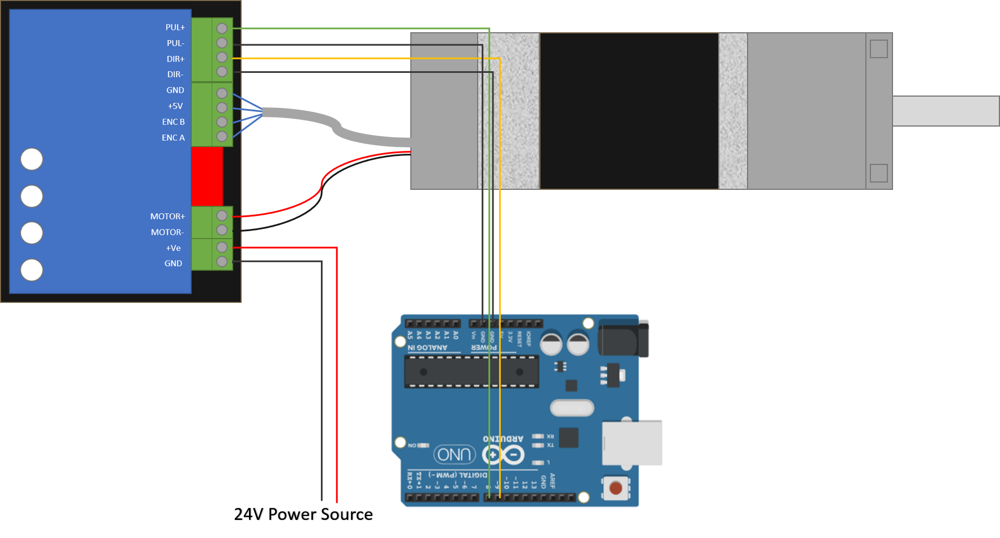
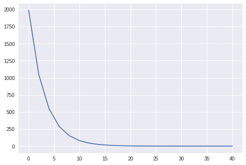

## Motor Driver RMCS2301 with Plantery Geared Motor RMCS2004
This is an arduino code for accelerating the [Planetary Geared Motor RMCS 2004](https://robokits.co.in/motors/encoder-dc-servo/planetary-encoder-geared-motor-24v-175rpm-100w?cPath=2_3_317&) using the [RMCS 2301 Motor Driver](https://robokits.co.in/motor-drives-drivers/encoder-dc-servo/dc-servo-motor-driver-40v-20a-w-t-step-direction-input) previously unavailable on any platform.

This code works for accelerating the motor using **PWM signal** where the signal pulse width is a *square wave* whose width is being decreased over time to control the motor.

-------

# Circuit Diagram

-------

# Parameter and Working

This motor is like a vehicle motor wokring on a *clutch and acceleration mechanism*. In this mechanism we need to increase the speed slowly as the speed can't we achieved directly because the inital speed is very high and sudden increase in speed might damage the controller **RMCS-2301** is designed in such a way that if such a jerk comes is send the controller into a state of permanent error and the motor stops with a jerk.

So we decreased the signal pulse width slowly starting from 4 milisecond time period down to almost zero following an equation of 

Where *T= Time Period, d= Half the time period of square wave(delayMicros), a,k= constants* 

We followed this equation so that the initial speed is very low so the overshoot due to jerk doesn't send the motor driver in permanent state of error and then we slowly increase the speed as the pulsewidth falls down exponentially 

